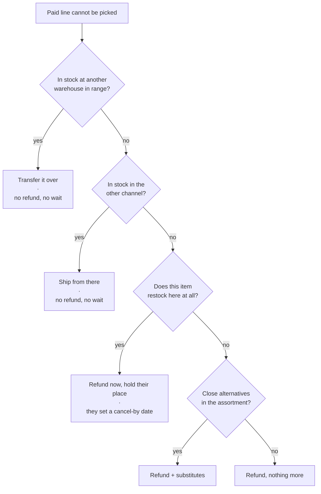

# Hold My Place

**What if a stockout didn't just end in a refund?**

I'm an international student, so almost all of my shopping happens in bulk.
It's cheaper per unit, it means fewer trips, and when you don't have a car every
trip costs you something. So my roommate and I put together a big Costco
delivery order — the usual staples, plus four packs of water bottles, which
between two of us is about a month of not having to think about water.

We paid. Then the notification came through: the water bottles were unavailable,
and that part of the order would be refunded.

The refund wasn't the problem. What came after was. We spent the next couple of
days going store to store trying to find the same thing again — same number of
bottles, roughly the same price per unit. Nothing lined up. Every place had a
slightly different pack size at a worse rate. In the end we gave up and bought a
pack that cost more and had fewer bottles in it, which is precisely the opposite
of why anyone buys in bulk.

The bit that stayed with me was this. We were checking shelves by hand, store by
store, and Costco already knew where its own water was. Somewhere in their
system there's a number for how many packs are sitting in every other warehouse
in the region. We were running a search manually, badly, with no information,
that they could have done instantly.

So — what if the refund wasn't where it ended? What if the system checked the
other warehouses before giving up on me? And if the item genuinely wasn't
anywhere nearby, what if I could just keep my place in line for it instead of
starting from scratch as a customer? At that moment the retailer is holding a
genuinely useful fact about me, that I'll pay this price for this item at this
address, and a refund throws it in the bin.

That's the idea. The rest of this is me finding out whether it survives contact
with the numbers.

What's here is a simulation and a unit-economics model, not a product. I mostly
wrote it to work out where my own idea was wrong, and it was wrong in five
places. They're all below, including the one that would have killed the whole
thing if I'd trusted my first metric.

```bash
python -m holdmyplace.sim.run --days 90                 # one run
python -m holdmyplace.sim.run --days 90 --sensitivity   # plus the economics grid
python -m holdmyplace.demo.build                        # regenerate demo/index.html
python -m pytest                                        # 262 tests
```

Standard library only. Python 3.11+, no dependencies to install.

---

## The idea

My first instinct was "put people in a queue." That instinct was too eager.

Inventory in a warehouse club is per-location, and the online and in-store
assortments aren't the same pool of stuff. So "out of stock" at the warehouse
that was supposed to pick your order very often isn't out of stock at all — it's
sitting on a shelf twenty minutes away, or in the other channel's inventory.
Offering somebody a two-week wait in that situation is just a bad answer.

So a queue shouldn't be the first thing you reach for. It should be the third.
The rungs below are ordered by how close each outcome is to what the customer
actually asked for, not by what's easiest to build:



Whenever the ladder skips a rung it records why. So the customer never just gets
a "no," they get a reason, and afterwards you can audit what the system decided.

---

## Why the queue is actually fair

There are two rules doing most of the work here.

**Your order time decides who gets a unit. Your deadline only decides whether
you're still in line.** You pick your own cancel-by date, and that date is used
as a filter, never as a sort key.

This part I'm quite happy with. Any "how urgent is this?" field that a customer
fills in themselves will be maxed out by everybody within about a week — that's
just how self-reported priority works. But because the deadline filters instead
of sorting, setting an aggressive date strictly *reduces* the number of restocks
that can reach you. Lying makes your outcome worse. So people report honestly
and you need no verification, no policing, nobody investigating abuse.

> `tests/test_queue.py::test_tightening_a_deadline_never_gains_a_unit`
> checks this holds across a grid of deadlines and arrival dates.

**Eligibility is read, not predicted.** I spent a while assuming this needed a
model, and it doesn't. A buyer decided months ago whether an item gets
reordered, and that decision already sits in the item master as a lifecycle
status. You just look it up:

| Lifecycle | Claim? | What the customer sees |
|---|---|---|
| Core / regularly stocked | ✅ | Claim with an estimated return window |
| Temporarily unavailable | ✅ | Claim, wider estimate band |
| Seasonal, window open | ✅ | Claim, capped at the season end |
| Seasonal, window closed | ❌ | "We'll tell you next season" |
| Opportunistic / one-time buy | ❌ | Refund + substitutes |
| Discontinued | ❌ | Refund + substitutes |

Anything not on that allowlist is ineligible by default, and I made that
deliberate. If the lifecycle is unrecognised, or there's no replenishment
history, or the return estimate comes back with low confidence, the system
refunds cleanly instead of promising something. A button that never appears is
invisible to the customer. A promise you break is a support ticket and a bit of
lost trust.

---

## What the simulation told me

Five things. Four of them contradicted what I'd written down first.

### 1. My first metric was measuring the wrong thing

I originally gated the whole idea on this: *of stockout events, what share are
on items that restock within 30 days?* Pass above 50%.

It comes out at **33–49%**. By my own rule I should have binned the project.

Except the metric is wrong. It counts events the design never promises anything
about. A one-time buy gets a clean refund and no claim is offered, so there is
no promise there to break — but the metric scores that as a failure. It
punishes the eligibility check for working correctly.

The number that actually matters is **promises kept**: of the claims people
actually filed, how many got filled before their own deadline. That's **78–86%
across eight seeds**, and it passes.

| Metric | What it means | Typical |
|---|---|---|
| Addressable | Share on items that restock at all | 33–49% |
| Coverage | Share where a claim was offered | ~29% |
| **Promises kept** | **Of claims filed, share filled in time** | **78–86%** |

Three different numbers, and I'd collapsed the first into the third.

### 2. The ladder does more work than the queue

Sourcing the item outright resolves **27–36%** of stockout lines. No refund, no
waiting, original order left alone. Here's the same run with sourcing switched
off, so everything routes straight to a queue:

| | Ladder off | Ladder on |
|---|---|---|
| Claims filed | 149 | **115** |
| Customer got the item they ordered | 31.6% | **42.3%** |
| Refunds paid out | $30,159 | **$24,411** |

Fewer promises to keep, more people served, about a fifth less money handed
back. The queue I started out designing turned out to be the smaller half of
the answer.

### 3. Reserving stock barely touches the shelf

The first objection anybody in operations would raise is that holding units
back for a queue strips the sales floor. Turns out it doesn't:

| Queue share of each receipt | Claims filled | Promises kept |
|---|---|---|
| 0% | 0 | 0% |
| 5% | 60 | 52% |
| **15%** | **87** | **76%** |
| 25% | 91 | 79% |
| 90% | 100 | 87% |

Returns flatten out hard after 15–25%. And in absolute terms the queue ate **91
units while 40,289 went to the floor**, which is under a quarter of one percent.
The 0% row matters too, in the other direction: give the queue no allocation and
it never fills, so how much you reserve is the one thing here that's genuinely
an argument.

### 4. Free delivery doesn't pay for itself

This was the uncomfortable one.

```
Top-up basket                      $85.00
Genuinely new demand (30%)         $25.50
Gross margin at 11%                 $2.81
Cost of an adjacent stop           -$4.00
                                   ------
Merchandise only                   -$1.19   ← doesn't clear
With renewal value at 0.5pp         $2.71
```

On merchandise margin alone it loses money, and no amount of rearranging fixed
that. It only clears once you count membership renewal — which means this isn't
really a fulfillment feature at all, it's a retention play. Any team measuring
cost-per-stop will reject it, and they'd be right to. It needs to be pitched to
whoever owns renewal instead.

Break-even needs **0.153pp** of renewal lift. That's small enough to be
believable, which I'd say is an argument for running a pilot rather than an
argument for shipping. Run with `--sensitivity` to see the grid over both
unknowns; the useful bit is where the sign flips, not any individual cell.

Related thing the model caught: batching deliveries only beats piggybacking
once a cluster gets big enough. Adding a stop to a van already driving past you
carries no fixed cost, so a dedicated route only wins once there are enough
stops to amortize putting it on the road. **9 stops** with the default numbers.
My first cost model had batching losing to piggybacking at every size, which
made the feature pointless.

### 5. The best by-product needs more volume than I expected

Every open claim carries an item, an area, and a deadline the customer chose
themselves. Add those up and you get a demand curve on something that's
currently out of stock, with a time axis and a geography attached. That's a
freight decision denominated in dollars, and as far as I can tell nobody has it,
because everyone destroys the intent at the moment of refund.

I was pretty pleased with this until I checked what the model actually produces.
At the default scale — one metro, 400 items, about 9 stockout lines a day — the
biggest cluster is 3 open claims with nothing expiring soon. That's not a pallet
decision, that's noise. Sweeping volume:

| Lines/day | Items | Claims filed | Largest cluster |
|---|---|---|---|
| 9 | 400 | 115 | 3 open, 0 expiring |
| 40 | 400 | 557 | 6 open, 1 expiring |
| 120 | 400 | 1,691 | 10 open, 2 expiring |
| 120 | 150 | 2,249 | 36 open, 5 expiring, $94 |
| 300 | 150 | 5,709 | **79 open, 23 expiring, $432** |

So it only gets useful at regional or national aggregation, or on a narrow
assortment where demand concentrates. Sold as a per-warehouse tool it would fall
apart on first contact with real data. Sold as a network-level input to
allocation, I think it holds.

---

## The demo

`demo/index.html` walks through it: the customer's screen on the left, what the
system did on the right — the ladder walk with its rejection reasons, the
eligibility read, the return estimate, how the receipt got split, the queue with
its served / skipped / waiting rows, and the routing decision.

It's generated rather than hand-written, which was the point.
`holdmyplace/demo/scenario.py` runs the actual domain logic across every branch
and dumps the results; `template.html` has one `__SCENARIO_JSON__` placeholder
and no logic of its own. Every verdict, position, date, mode, cost and line of
customer-facing copy comes out of `holdmyplace/domain`. Change a rule, rerun
`demo.build`, and the screens follow. I did it this way because a mockup that
disagrees with the system it's illustrating is worse than no mockup.

---

## Layout

```
holdmyplace/
  domain/
    catalog.py    lifecycle + channel → eligibility, fails closed
    claims.py     deadlines, price lock, state transitions
    restock.py    return estimation, splitting a receipt queue vs floor
    sourcing.py   the resolution ladder and its audit trail
    offers.py     composition: sourcing first, then eligibility
    queue.py      FIFO allocation, deadline filter, demand aggregation
    routing.py    mode selection, cost curve, density batching
    economics.py  assumptions with provenance, contribution, sensitivity
  sim/
    generate.py   synthetic world; stockouts weighted toward one-way items
    run.py        the day loop and its metrics
    report.py     console output
  demo/
    scenario.py   evaluates every branch through the domain modules
    template.html presentation only, one placeholder, no rules
    build.py      injects the data, writes demo/index.html
```

The package is `holdmyplace`, lowercase, because that's what `import` needs. The
repo is `HoldMyPlace`. Don't rename the folder to match — it breaks every
import.

---

## What I'd want you to know before believing any of this

`economics.py` tags every input as `PUBLIC`, `POLICY`, `ESTIMATED` or `UNKNOWN`,
and the report prints those tags next to the values. Two are flagged
load-bearing — `renewal_lift_pp` and `topup_incrementality` — because their
plausible ranges are wide enough to flip the conclusion's sign on their own. A
test fails if somebody adds an input without documenting where it came from.

**None of this is validated against real data.** The numbers that would actually
decide it are internal to a retailer: post-payment stockout rate, restock share
at the fulfilling location, the renewal delta after a stockout refund, the true
marginal cost of an adjacent stop, and how often an out-of-stock item is really
in stock within transfer range. What this repo does is model the mechanism and
show which unknowns matter. It doesn't forecast the outcome, and I'd be
suspicious of anyone claiming it could.

Two gaps I knowingly left open:

- **Supplier capacity isn't modelled.** During a demand spike the estimator is
  reading backward-looking cadence, which means it'll over-promise on exactly
  the highest-volume items — adverse selection, basically. The fix is to
  discount confidence when recent sell-through diverges from history so it fails
  closed on spikes. Haven't done it yet.
- **How customers react to a warning is a parameter, not a finding.** The
  proceed / extend / refund split is just config I picked.

---

*Independent design exercise. Not affiliated with or endorsed by any retailer.
Item names, prices and members are all synthetic.*
