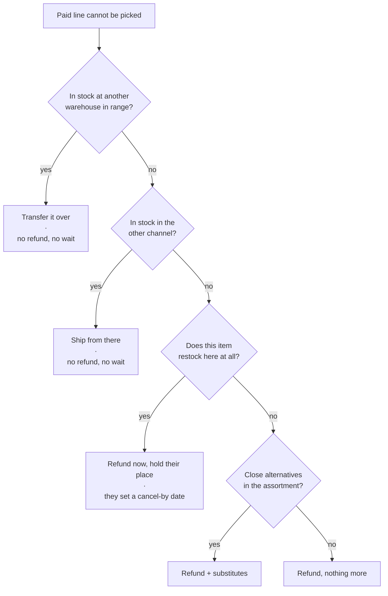

# Hold My Place

**A resolution ladder for retail out-of-stock, and a fair claim queue at the bottom of it.**

You pay for a delivery order. Afterwards, one line is out of stock. Today that
line is refunded and the transaction ends — and with it goes the single most
valuable thing in the interaction: a customer who has already proven they will
pay *this price* for *this item* at *this address*.

This repository models a better ending. It is a simulation and a unit-economics
model, not a production system, and it exists to find out where the idea is
wrong. It found five places. They are documented below.

```bash
python -m holdmyplace.sim.run --days 90                 # one run
python -m holdmyplace.sim.run --days 90 --sensitivity   # plus the economics grid
python -m holdmyplace.demo.build                        # regenerate demo/index.html
python -m pytest                                        # 262 tests
```

No dependencies. Standard library only, Python 3.11+.

---

## The idea in one diagram

A claim is the **third** answer, not the first. Inventory is location-specific
and the online and in-warehouse assortments are separate pools, so "out of stock
here" often is not out of stock. Rungs are ordered by how close each outcome is
to what the customer actually asked for — not by what is cheapest to build.



Every rung the ladder passes over is recorded with the reason it was rejected.
That trail is the difference between *"no"* and *"no, because"*.

---

## The mechanism that makes the queue fair

Two rules carry the design.

**Order time decides who gets a unit. The deadline decides only who is still in
line.** The customer sets their own cancel-by date, and that date is applied as
a *filter*, never as a sort key.

This is the whole reason self-reported urgency can be trusted. Any priority
field a customer fills in themselves gets maxed out within a week. Here, a
tighter deadline strictly *shrinks* the set of restocks that can serve you — so
overstating urgency is self-punishing, and honest reporting needs no
verification, no policing, and no abuse team.

> `tests/test_queue.py::test_tightening_a_deadline_never_gains_a_unit`
> asserts this across a grid of deadlines and arrival dates.

**Eligibility is read, not predicted.** A buyer decided months ago whether an
item gets reordered, and that decision already sits in the item master as a
lifecycle status. No model required:

| Lifecycle | Claim? | What the customer sees |
|---|---|---|
| Core / regularly stocked | ✅ | Claim with an estimated return window |
| Temporarily unavailable | ✅ | Claim, wider estimate band |
| Seasonal, window open | ✅ | Claim, capped at the season end |
| Seasonal, window closed | ❌ | "We'll tell you next season" |
| Opportunistic / one-time buy | ❌ | Refund + substitutes |
| Discontinued | ❌ | Refund + substitutes |

Anything not on the allowlist is ineligible by default. **Failing closed is the
rule**: an unrecognized status, a missing cadence, or a low-confidence estimate
all produce a clean refund rather than a promise nobody can keep. An absent
button is invisible; a broken promise is a support ticket.

---

## What the simulation found

Five findings. Four of them contradicted the design as originally written.

### 1. The first metric I chose was measuring the wrong thing

The original gate was *"of out-of-stock events, what share are on items that
restock within 30 days?"*, passing above 50%. That runs **33–49%** — it would
have killed the idea.

It is the wrong test. It counts events the design never promises anything
about: a one-time buy is refunded cleanly with no claim offered, so there is
nothing to break. It reads as failure precisely when eligibility screening is
doing its job.

The gate belongs on **promises kept** — of claims filed, the share filled before
the customer's own deadline. That runs **78–86% across eight seeds**, and passes.

| Metric | Means | Typical |
|---|---|---|
| Addressable | Share on items that restock at all | 33–49% |
| Coverage | Share where a claim was offered | ~29% |
| **Promises kept** | **Of claims filed, share filled in time** | **78–86%** |

### 2. The ladder does more work than the queue

Sourcing the item resolves **27–36%** of out-of-stock lines outright. Switching
it off and routing straight to a queue:

| | Ladder off | Ladder on |
|---|---|---|
| Claims filed | 149 | **115** |
| Customer got the item they ordered | 31.6% | **42.3%** |
| Refunds paid out | $30,159 | **$24,411** |

Fewer promises to keep, more customers served, a fifth less money handed back.

### 3. Reserved inventory barely touches the shelf

The obvious operational objection is that reserving units for a queue strips the
sales floor. It does not:

| Queue share of each receipt | Claims filled | Promises kept |
|---|---|---|
| 0% | 0 | 0% |
| 5% | 60 | 52% |
| **15%** | **87** | **76%** |
| 25% | 91 | 79% |
| 90% | 100 | 87% |

Returns flatten hard past 15–25%, and in absolute terms the queue consumed **91
units against 40,289 released to the floor** — under a quarter of one percent.
The zero row matters too: a queue with no allocation never fills, which makes
the reservation share the one genuinely contested ask.

### 4. Free delivery does not pay for itself on merchandise margin

```
Top-up basket                      $85.00
Genuinely new demand (30%)         $25.50
Gross margin at 11%                 $2.81
Cost of an adjacent stop           -$4.00
                                   ------
Merchandise only                   -$1.19   ← does not clear
With renewal value at 0.5pp         $2.71
```

It clears only once membership renewal is counted — which makes this a
**retention program wearing a fulfillment feature's clothes**. A fulfillment
cost-per-stop metric will reject it correctly, every time, forever.

Break-even needs **0.153pp** of renewal lift. Small enough to be plausible,
which is the argument for running a pilot, not for shipping the feature.
`--sensitivity` prints the grid over both unknowns; read the sign boundary, not
the cells.

A related correction the model forced: batching only beats piggybacking above a
break-even cluster size. Appending a stop to a route already passing nearby
carries no fixed cost, so a dedicated van wins only once enough stops amortize
putting it on the road — **9 stops** at default parameters.

### 5. The best by-product is volume-hungry

Every open claim carries an item, a delivery area, and a customer-declared
deadline. Aggregated, that is a time-bound, geographically resolved demand curve
on something currently out of stock — a freight-expedite decision denominated in
dollars. Every large grocer has out-of-stock refunds; none can compute this,
because the intent is destroyed at the moment of refund.

**But the model shows the signal needs scale to be useful.** At
the default scale — one metro, 400 items, ~9 out-of-stock lines a day — the
largest cluster it produces is 3 open claims and nothing expiring soon. That is
not a pallet decision. Sweeping volume:

| Lines/day | Items | Claims filed | Largest cluster |
|---|---|---|---|
| 9 | 400 | 115 | 3 open, 0 expiring |
| 40 | 400 | 557 | 6 open, 1 expiring |
| 120 | 400 | 1,691 | 10 open, 2 expiring |
| 120 | 150 | 2,249 | 36 open, 5 expiring, $94 |
| 300 | 150 | 5,709 | **79 open, 23 expiring, $432** |

The signal only becomes actionable at regional or national aggregation, or on a
narrow assortment where demand concentrates. Pitching it as a per-warehouse tool
would not survive contact with the data. Pitched as a network-level input to
allocation, it holds up.

---

## The demo

`demo/index.html` is an interactive walkthrough: the customer's screen on the
left, what the system did on the right — the ladder walk with its rejection
reasons, the eligibility read, the return estimate, the receipt split, the queue
with served/skipped/waiting rows, and the routing fork.

It is **generated, not hand-written**. `holdmyplace/demo/scenario.py` runs the
real domain logic over every branch and serializes the results;
`template.html` holds a single `__SCENARIO_JSON__` placeholder and no rules of
its own. Every verdict, queue position, mode, date, cost and line of customer
copy comes from `holdmyplace/domain`. Change a rule, re-run `demo.build`, and
the screens follow.

---

## Layout

```
holdmyplace/
  domain/
    catalog.py    lifecycle + channel → eligibility, fail-closed
    claims.py     deadlines, price lock, state transitions
    restock.py    return estimation, receipt split between queue and floor
    sourcing.py   the resolution ladder and its audit trail
    offers.py     composition: sourcing first, then eligibility
    queue.py      FIFO allocation, deadline filter, demand-signal aggregation
    routing.py    mode selection, cost curve, density batching
    economics.py  assumptions with provenance, contribution, sensitivity
  sim/
    generate.py   synthetic world; out-of-stock weighted toward one-way items
    run.py        the day loop and its metrics
    report.py     console output
  demo/
    scenario.py   evaluates every branch through the domain modules
    template.html presentation only — one placeholder, no rules
    build.py      injects the data, writes demo/index.html
```

The importable package is `holdmyplace` (lowercase); the repository is
`hold-my-place`. Renaming the package directory breaks every import.

---

## Honest limits

`economics.py` tags every input `PUBLIC`, `POLICY`, `ESTIMATED`, or `UNKNOWN`,
and the report prints those tags. Two are marked load-bearing —
`renewal_lift_pp` and `topup_incrementality` — because their plausible ranges
flip the sign of the conclusion. A test fails if an undocumented input is added.

**Nothing here is measured against real data.** The figures that actually govern
the decision are internal to a retailer: post-payment out-of-stock rate, restock
share at the fulfilling location, renewal delta after an out-of-stock refund,
true marginal cost of an adjacent stop, and how often an out-of-stock item is
genuinely in stock within transfer range. This models the mechanism and shows
which unknowns matter. It does not forecast the outcome.

Two known gaps, left open deliberately:

- **Supplier capacity is not modelled.** During a demand spike the estimator
  reads backward-looking cadence and will over-promise on exactly the
  highest-volume items. The fix is to discount confidence when recent
  sell-through diverges from history, so the system fails closed on spikes.
- **Customer response to a warning is a parameter, not a finding.** The
  proceed / extend / refund split is config.

---

*Independent design exercise. Not affiliated with, endorsed by, or prepared on
behalf of any retailer. Item names, prices and members are synthetic.*
